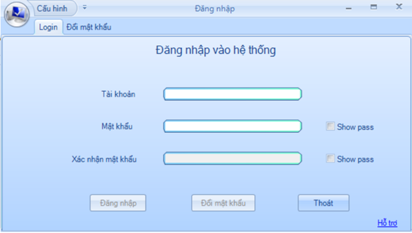
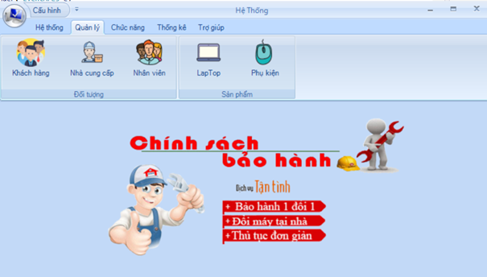
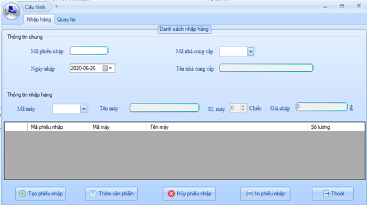
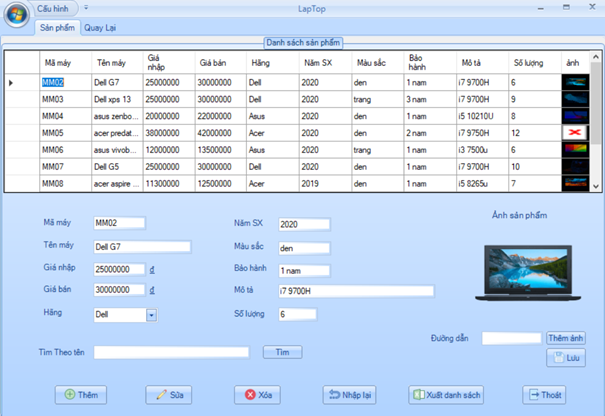
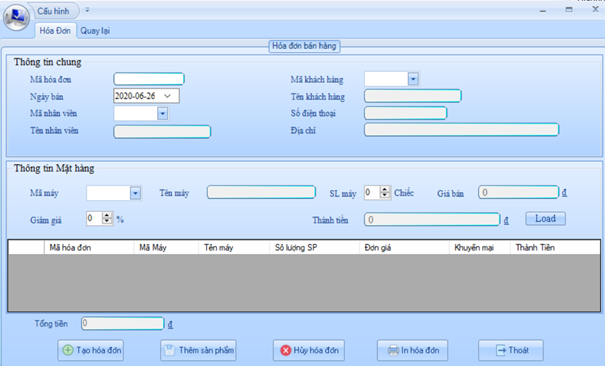
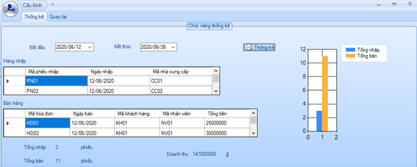

# Phần mềm quản lý cửa hàng laptop be bé 💻🖱

*do viết lâu rồi giờ up lại nên không biết có chuẩn hết hay không*

***use net framework 4.5***

## Chức năng
khá đầy đủ và gần như hoàn thiện từ:
- đăng ký, đăng nhập
- phân quyền admin, user khi vào hệ thống
- tìm kiếm sản phẩm, thêm sửa xóa
- nhập hàng, xuất hàng
- thêm ảnh, chỉnh sửa ảnh sản phẩm (*cái này hơi ngu vì hồi đó mình lưu ảnh trực tiếp trong sql*)
- tạo hóa đơn
- bảo hành, trả góp
- báo cáo thống kê theo thời gian chọn,...
## Một số hình ảnh trong app
* giao diện login

_________________________________
* giao diện home

_________________________________
* giao diện nhập hàng

_________________________________
* giao diện sản phẩm

_________________________________
* giao diện hóa đơn

_________________________________
* giao diện thống kê

_________________________________
